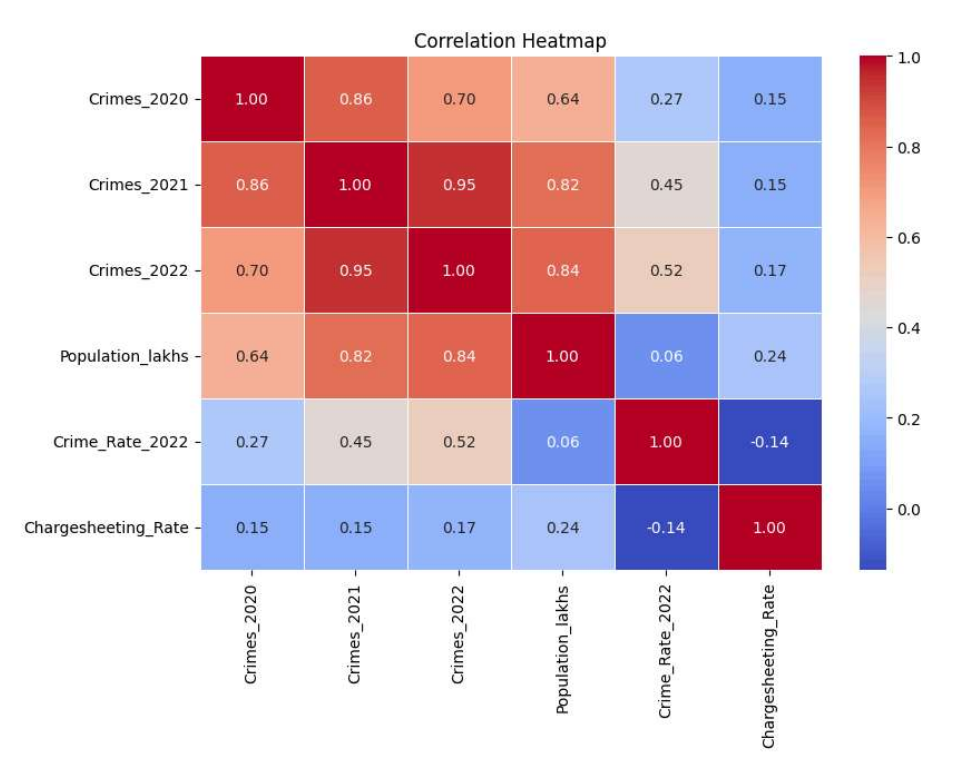
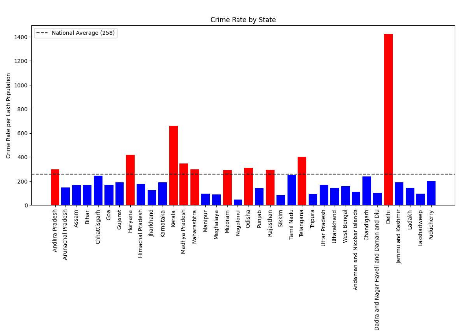
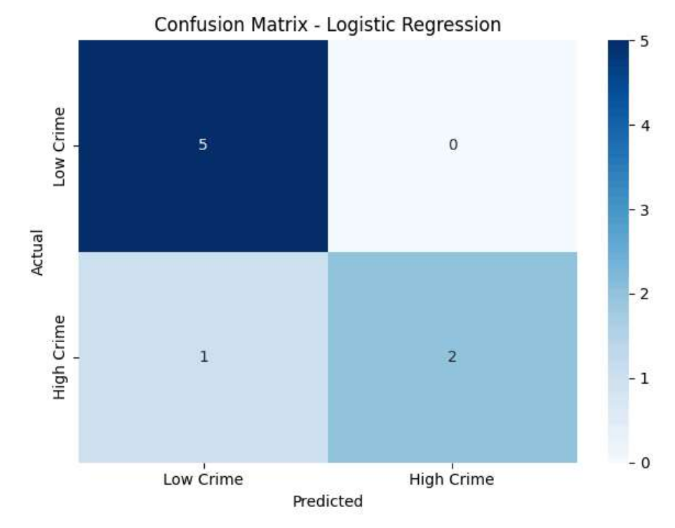

# Crime Trend Prediction Using Machine Learning

## Overview

This project analyzes and predicts crime trends across Indian states using NCRB crime data. Machine Learning models were developed to identify crime patterns, forecast crime rates, and classify regions based on crime severity.

## Features

- Exploratory Data Analysis (EDA)
- Correlation Analysis
- Crime Rate Visualization
- Multiple Linear Regression
- Logistic Regression Classification
- Crime Trend Prediction
- Model Evaluation and Comparison

## Technologies Used

- Python
- Pandas
- NumPy
- Matplotlib
- Seaborn
- Scikit-learn
- Jupyter Notebook

## Dataset

Source: National Crime Records Bureau (NCRB)

Dataset includes:
- State
- Crimes 2020
- Crimes 2021
- Crimes 2022
- Population
- Crime Rate
- Chargesheeting Rate

## Machine Learning Models

### Multiple Linear Regression
Used to predict crime rates based on crime statistics, population, and chargesheeting rate.

### Logistic Regression
Used to classify regions into High Crime and Low Crime categories.

## Model Performance

- Multiple Linear Regression R² Score: 0.54
- Logistic Regression Accuracy: 88%
## Project Visualizations

### Correlation Heatmap

### Crime Rate by State

### Confusion Matrix

## Key Insights

- Crime trends vary significantly across Indian states.
- Population and previous crime statistics strongly influence future crime rates.
- Machine learning models can support crime forecasting and planning.

## Future Enhancements

- Random Forest Regression
- ARIMA Time Series Forecasting
- Power BI Dashboard
- Real-Time Crime Monitoring
- Additional Socioeconomic Factors

## Author

Dhanush G
